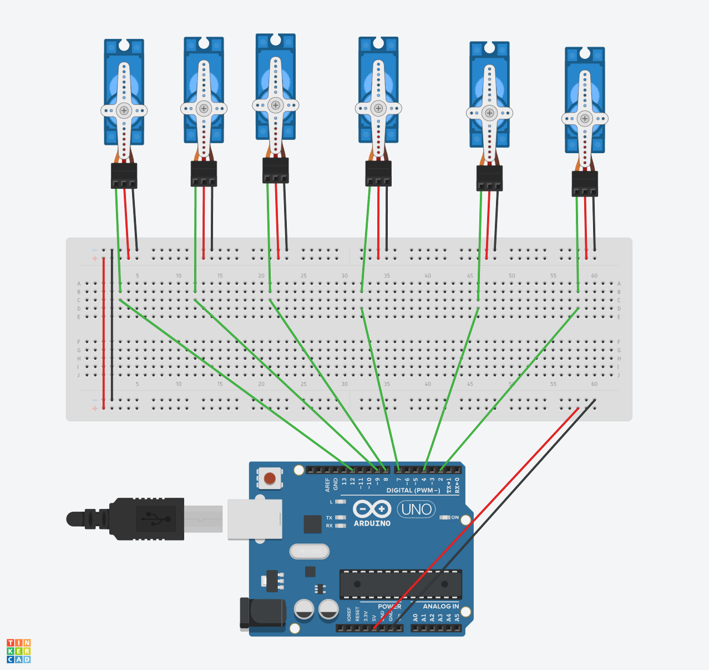

# servomotors

#Task 1

## Task 1: write algorithm to run 6 servo motors for making robot moves 

# Arduino Multi-Servo Sweep Project

This project demonstrates how to control multiple servo motors using an Arduino. It is based on the Sweep example from the Arduino library, modified to control six servo motors.

## Table of Contents
1. [Introduction](#introduction)
2. [Components](#components)
3. [Circuit Diagram](#circuit-diagram)
4. [Code Explanation](#code-explanation)
5. [Setup and Usage](#setup-and-usage)
6. [License](#license)

## Introduction
The original Sweep example code has been extended to control six servos, sweeping them from 0 to 180 degrees and back. This project is useful for applications requiring synchronized movement of multiple servos.

## Components
- Arduino board (e.g., Uno, Mega)
- 6 Servo motors
- Jumper wires
- Breadboard (optional for easy wiring)

## Circuit Diagram
Connect the servo motors to the Arduino as follows:
- Servo 1: Signal to pin 9
- Servo 2: Signal to pin 2
- Servo 3: Signal to pin 4
- Servo 4: Signal to pin 7
- Servo 5: Signal to pin 8
- Servo 6: Signal to pin 12

Ensure all servo grounds are connected to the Arduino ground, and servo power lines are connected to an appropriate power source.

## Code Explanation

```cpp
/*
  Sweep
  by BARRAGAN <http://barraganstudio.com>
  This example code is in the public domain.

  modified 8 Nov 2013
  by Scott Fitzgerald
  https://www.arduino.cc/en/Tutorial/LibraryExamples/Sweep
*/

#include <Servo.h>

// create servo objects to control servos
Servo myservo;
Servo servo_2;
Servo servo_4;
Servo servo_7;
Servo servo_8;
Servo servo_12;

int pos = 0;  // variable to store the servo position

void setup() {
  myservo.attach(9);  // attaches the servo on pin 9 to the servo object
  servo_2.attach(2);
  servo_4.attach(4);
  servo_7.attach(7);
  servo_8.attach(8);
  servo_12.attach(12);
}

void loop() {
  for (pos = 0; pos <= 180; pos += 1) { // goes from 0 degrees to 180 degrees
    servo_4.write(pos);
    servo_2.write(pos);
    servo_7.write(pos);
    servo_8.write(pos);
    servo_12.write(pos);
    myservo.write(pos);  // tell servo to go to position in variable 'pos'
    delay(15);  // waits 15 ms for the servo to reach the position
  }
  for (pos = 180; pos >= 0; pos -= 1) { // goes from 180 degrees to 0 degrees
    myservo.write(pos);
    servo_2.write(pos);
    servo_8.write(pos);
    servo_7.write(pos);
    servo_12.write(pos);
    servo_4.write(pos);
    delay(15);  // waits 15 ms for the servo to reach the position
  }
}
```
#Task 2
## design a electronic circute contain 6 servo motor on simulator app (used tinkCard) link down below 
### https://www.tinkercad.com/things/gKbDbj4TwT7-epic-densor




